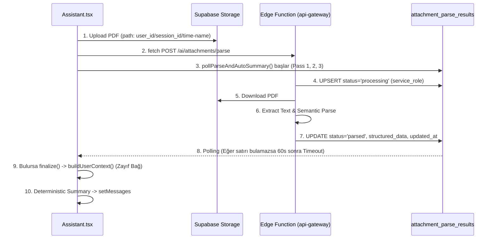

# debugging.md

Hata günlüğü ve öğrenimler.

## Kayıt Şablonu

### 27. Final Regression UAT (2026-05-13)

**Semptom:** AI Asistan ve Financial Health Score sistemlerinin kilitlenmesi öncesi regression (gerileme) testi gereksinimi.
**Root Cause:** Yok.
**Çözüm:** Test scriptleri (Fixture 1, 4, 6A, 6B, 6C) üzerinden WNW kriz limitleri, güçlü kullanıcı değerleri, gecikmemiş borç toleransı, gerçek gecikme sinyalleri ve Nakit Akışı uyarılarının tamamının sorunsuz çalıştığı doğrulandı. UAT maddeleri teker teker test edildi ve PASS alındı.
**Durum:** Final Regression UAT PASS. AI Assistant ve Score SSOT modülleri LOCKED durumuna getirildi.

### 26. Final Scoring Hardening (Phase SCORE-SSOT-3) (2026-05-13)

**Semptom:** Aktif borçların temerrüt sayılması, Cash Flow Warning olduğunda rozetin "Optimal Durum" kalması ve Teknik İflas durumunda koç açıklamasının pozitif bir ara cümle içermesi. Ayrıca UI'da çift versiyon (v8.9 ve v6.1.1) görünüyor olması.
**Root Cause:** 
- `hasOverdue` mantığı `remainingAmount > 0` şartı nedeniyle normal borçları kapsıyordu.
- Cash Flow Warning `severity` değerini `warning` yapsa da `badgeLabel` değiştirilmemişti.
- `generateInsights` içinde `explanation` string template'i kriz olsa bile pozitif durumu ekliyordu.
- `FinancialScoreCard` `label` değişkenini okumaya devam ediyor ve başlıkta v8.9 hardcoded taşıyordu.
**Çözüm:** 
- `hasOverdue` sadece `status === 'overdue'` için aktif edildi.
- Cash Flow Warning rozeti "⚠️ Nakit Akışı Uyarısı" olarak ayarlandı.
- Versiyon karmaşası UI'dan temizlendi, sadece assessment versiyonu bırakıldı.
- Kriz açıklamaları sadece saf kriz mesajını yansıtacak şekilde izole edildi.
**Durum:** DONE. Test script ile 6A, 6B, 6C durumları doğrulandı.

### 25. Skor, Rozet ve Durum Tutarsızlığı (Impossible State) (Phase SCORE-SSOT-2) (2026-05-13)

**Semptom:** Dashboard skor widget'ında "Skor: 85, Durum: TEKNİK İFLAS, Badge: OPTİMAL DURUM, Borç/Gelir: 35.2x" şeklinde imkansız bir kombinasyon gösteriliyordu.
**Root Cause:** 
1. UI bileşeni (`FinancialScoreCard`), Engine'in kriz flag'ini dinlemeden, yalnızca `score >= 85` sayısına bakarak "Optimal Durum" rozeti üretiyordu (SSOT ihlali).
2. Engine (`scoringEngine`), "WNW < 0" kriz durumunda skoru <=14 aralığına kilitlemesi gerekirken, esnek bir DTI bazlı formül (dynamicCrisisScore) ile 85'e kadar çıkartabiliyordu.
3. UI'da "Borç/Gelir" diye gösterilen alan aslında (Toplam Borç / Aylık Gelir) idi, bu yüzden 35.2x gibi DTI olarak kafa karıştırıcı sayılar çıkıyordu.
**Çözüm:**
- `scoringEngine` refaktör edilerek `FinancialHealthAssessment` adında tek, bütünleşik bir çıktı (score, severity, badgeLabel, vs) sağlandı.
- `wnw < 0` için `Math.max(0, Math.min(14, dynamicCrisisScore))` ile katı skor tavanı uygulandı.
- UI bileşenlerindeki hesaplama mantıkları kaldırılarak sadece Engine'den gelen `assessment` objesi render edildi.
- "Borç/Gelir" etiketi "Aylık Borç Yükü" olarak değiştirilip `structuralDti` (yüzde cinsinden) kullanıldı.
- Impossible state'leri yakalayacak DEV-only bir guard UI içerisine kondu.
**Değişen dosyalar:** `src/services/scoringEngine.ts`, `src/components/dashboard/widgets/FinancialScoreWidget.tsx`, `src/components/insights/FinancialScoreCard.tsx`
**Durum:** DONE. Test senaryolarıyla WNW < 0 anında skorun 7 geldiği, badge'in KRİTİK SEVİYE olduğu doğrulandı.

### 24. Findeks Kredi Notu "0" / Missing Ayrımı & DEV Log Cleanup (Phase 7.2F-I) (2026-05-12)

**Semptom:** Kredi notu 0 geldiğinde `!!creditScore` yapısı nedeniyle değer `false` kabul ediliyor ve "bulunamadı" / missing davranışı sergiliyordu. Ayrıca production console gürültüsü yüksekti.
**Root Cause:**
1. Truthy kontroller (`!!`) `0` ve `""` değerlerini aynı kefeye koyar. Finansal veride `0` gerçek bir değerdir.
2. `import.meta.env.DEV` tüm development loglarını acar; çok fazla diagnostic log konsolu dolduruyordu.
**Çözüm:**
- `hasKnownValue(value)` helper'ı eklendi (`value !== null && value !== undefined && value !== ''`).
- `buildDeterministicIntentAnswer` ve `isFindeksResult` fonksiyonlarındaki kontroller bu helper ile güncellendi.
- Diagnostic loglar `ASSISTANT_DEBUG` (VITE_ASSISTANT_DEBUG) bayrağı arkasına alındı. `APP_BUILD_MARKER` güncellendi.
**Değişen dosyalar:** `src/pages/Assistant.tsx`
**Durum:** Phase 7.2F-I Final UAT PASS. Final Smoke PASS. AI Assistant Findeks Auto-Summary LOCKED.

### 23. Resilient Polling Scope Leak & FK Conflict (2026-05-11)

**Semptom:** Non-PDF dosyalar (Changelog.md vb.) için de polling tetiklenmesi ve Pass-3 latest fallback nedeniyle alakasız summary üretilmesi. Session değişimi sırasında `chat_messages_session_id_fkey` 409 conflict hatası.
**Console kanıtları:** `[7.2F_RESILIENT_POLL_TRIGGER] fileName: 'Changelog.md'`, `[7.2F_ROW_FOUND] Pass-3 (latest)`.
**Root Cause:**
1. Resilient polling trigger'ın dosya tipi ve zaman filtresi olmaması.
2. Pass-3 fallback'in dosya adı doğrulaması yapmadan "user'ın son parsed satırını" çekmesi.
3. `addMessage` çağrısının aktif session kontrolünden önce yapılması.
**Çözüm:**
- `useEffect` trigger'ına PDF, recency (5 dk) ve activeSession filtreleri eklendi.
- Polling loop'tan Pass-3 latest fallback kaldırıldı (sadece path ve filename bazlı Pass-1/2 kaldı).
- `addMessage` öncesine `isCurrentSession` guard'ı eklendi.
**Değişen dosyalar:** `src/pages/Assistant.tsx`
**Durum:** Phase 7.2F-H Final UAT PASS.

### 20. SyntaxError: Expected corresponding JSX closing tag for <> / Ternary Mismatch (2026-04-19)

**Sorun**: `src/pages/Installments.tsx` dosyasında "Expected corresponding JSX closing tag for <>" ve "TypeScriptParserMixin.parseConditional" hatalarıyla uygulamanın çökmesi.
**Kök Neden**:

1. `activeTab === 'installments'` bloğu için açılan `<>` (Fragment) etiketinin sonu yanlışlıkla `</div>` ile kapatılmıştı.
2. Daha da kritik olarak, blok `{activeTab === 'installments' ? (` (ternary) ile başlatılmış ancak else durumu (`:`) belirtilmeden kapatılmıştı. Bu durum derleyicinin "parseConditional" hatası fırlatmasına sebep oldu.
   **Çözüm**:
3. `</div>` etiketi `</>` ile düzeltildi.
4. Ternary operatörü (`?`) yerine, else durumu gerektirmeyen mantıksal VE (`&&`) operatörüne geçildi.
   **Öğrenim**: JSX içinde ternary (`? :`) kullanılıyorsa, React her zaman iki dalın da (true/false) mevcudiyetini bekler. Sadece belirli bir durumu göstermek istiyorsak `&&` operatörü hem daha temizdir hem de "missing colon" gibi syntax hatalarını engeller.

## 2026-04-14 (SURGICAL FIX FOR QUICKINPUT - Task 43.1)

- Tarih: 2026-04-14
- Problem (The Real Reason Behind "Save Button Failure"): `QuickInput.tsx`'in `handleSave` fonksiyonu içinde `Transactions.tsx` katmanından gelen `onSave` promise'i çağrıldığında `catch` statement'ı bulunmadığı için failed request'ler sessizce "Unhandled Promise Rejection" yaratıyordu. Hata yutuluyordu. DAHA DA ÖNEMLİSİ: Eğer sistemde hiç "Hesap" (Account) yoksa veya gecikiyorsa, `selectedAccountId` boş oluyordu fakat Buton Enable kalıyordu. Kullanıcı butona bastığında ise `if (!selectedAccountId) return;` bloğu sessizce işlemin durmasına sebep oluyordu.
- Çözüm (Buton Onarımı): `try...catch` bloğu eklendi ve daha önemlisi, `!selectedAccountId` durumunda sessiz return yerine UI üzerinde `setErrorMsg('Lütfen önce bir hesap ekleyin.')` uyarısı çıkarıldı.
- Öğrenim (Kategori Ağı Akıllanması ve Priority Logic): "Kira geliri" girildiğinde "kira" kelimesinden dolayı sistemin bunu "Kira & Aidat" (Gider) olarak algılaması bir mantık hatasıydı. Bunun üstesinden gelmek için `predictCategory` içine `type` parametresi eklenerek "Priority Logic" (Öncelik Mantığı) kuruldu. Artık metinde gelir ifade eden bir kelime veya `+` işareti varsa, harcama havuzları deaktive ediliyor ve önce "Gelir" sınıflarında eşleşme aranıyor. Giyim ve Yeme-İçme kümeleri ise yeni terimlerle ("pantolon", "kebap") genişletildi.

## 2026-04-13 (Kritik Hata: API Key Geçersizliği)

- Tarih: 2026-04-13
- Problem: Kayıt ve Giriş süreçlerinde Supabase Auth'tan "Invalid API key" (401/400) hatası dönmesi.
- Kök Neden 1: FSIA incelemesinde çevre değişkeninin adı (`VITE_SUPABASE_SUPABASE_ANON_KEY` -> `VITE_SUPABASE_ANON_KEY`) düzeltilmiş ancak değerinin geçerliliği kontrol edilmemiştir.
- Kök Neden 2: Kod içerisinde `import.meta.env.VITE_SUPABASE_ANON_KEY` runtime sırasında başarıyla yükleniyor; ancak `.env` içerisindeki değer gerçek bir JWT anahtarı (örn. `eyJ...`) yerine harfi harfine `your_supabase_anon_key_here` şeklindeki _placeholder (yer tutucu)_ metnidir.
- Kök Neden 3: `authService.ts` içindeki kontrol (`if (!supabaseKey) throw`) sadece değişkenin var olup olmadığını (`undefined`/boş) kontrol eder, anahtarın geçerli bir Supabase JWT formatında olup olmadığını doğrulamaz.
- Çözüm Planı:
  1. `.env` dosyasına projenin gerçek Supabase Anon Key'i girilmelidir. (Bu adım güvenli bir şekilde yapılmalıdır).
  2. "Environment Guard" Stratejisi geliştirilmeli: `authService.ts` ve `adapter.ts` içerisinde Supabase client'ı başlatılmadan önce `supabaseKey.startsWith('eyJ')` gibi bir semantik geçerlilik (sanity) kontrolü ile fail-fast (erken hata fırlatma) mekanizması eklenmeli.
- Öğrenim: Çevre değişkenlerinde değişken adının doğru olması yetmez; payload'un form ve mantık olarak da kurallara uyması gerekir. Hatanın çözüldü sanılması "name mapping" probleminin çözülüp payload sorununun gizli kalmasından kaynaklanmıştır.
- Neden-Sonuç: Geliştirici ortamında placeholder kullanıldığı için, string boş olmadığı sürece frontend çalışmış, ancak backend'e giden `apikey` header'ı arızalı olduğu için "Invalid API key" vermiştir.

### 11. Bi-directional Sync: Transactions to Installments (2026-04-16)

**Sorun**: İşlemler (Transactions) sayfasından bir taksit ödemesi silindiğinde, bu durumun taksit takvimini (PaymentCalendar) etkilememesi ve bakiyenin iade edilmemesi.
**Çözüm**: `Transactions.tsx` içindeki silme mantığına "Reverse Atomic Protocol" eklendi.
**Mantık Akışı**:

1. `category === 'Taksit Ödemesi'` kontrolü yapılır.
2. İşlem açıklaması (`lenderName - monthName Taksidi`) parse edilerek ilgili taksit ve ay anahtarı (`monthKey`) bulunur.
3. **Bakiye İadesi**: İşlem tutarı, hesap türüne göre ters işlemle iade edilir (Kredi kartı ise borç düşülür, nakit/banka ise bakiye artırılır).
4. **Takvim Geri Alma**: `installments` tablosunda `paymentHistory` içinden ilgili ay silinir ve `remainingMonths` 1 artırılır.
5. **İşlem Silme**: En son ana `transaction` kaydı silinir.
   **Hata Yönetimi**: Herhangi bir adımda hata oluşursa süreç durdurulur ve "Atomic Rollback" mantığı gereği transaction silinmez.

### 12. Debt Calculation & Sync Rectification (2026-04-16)

**Sorun**: Ödemeler yapılmasına rağmen nominal borcun Dashboard'da erimemesi ve `InstallmentCard` içinde eksi değerler (-1 Ödendi) oluşması.
**Çözüm**:

1. `PaymentCalendar.tsx` içinde ödeme yapıldığında `remainingMonths` bir azaltıldı, geri alındığında bir artırıldı.
2. `Dashboard.tsx` içindeki `totalDebt` hesaplaması, `Installments` sayfasındaki gibi `paymentHistory` duyarlı hale getirildi.
3. Dashboard "Toplam Borç" widget'ı enflasyon ayarına (`useRealValue`) bağlandı.
4. `InstallmentCard.tsx`'e `Math.max(0, ...)` güvenlik kontrolleri eklendi.

### 13. Fixed Timeline vs. Floating Timeline (2026-04-16)

**Sorun**: Taksitlerin sadece `remainingMonths` üzerinden hesaplanması yüzünden ödeme yapıldıkça bitiş tarihinin erkene kayması ve gelecek taksitlerin görünümden kaybolması.
**Çözüm**: "Permanent Anchor" (Mühürleme) mantığına geçildi.

1. `firstPaymentDate` alanı eklendi (Geriye dönük fallback formülü: `nextDate - (total - remaining) ay`).
2. Takvim döngüsü `remainingMonths` üzerinden değil, `firstPaymentDate` ve `totalMonths` aralığındaki tarihlere göre kuruldu.
3. Sonuç: Ödeme yapılsa dahi taksit kutuları ve itfa planı sabit kalır, sadece ayın statüsü 'paid' olarak güncellenir.

## 2026-04-13 (Infinite Spinner Fix)

- Tarih: 2026-04-13
- Problem: Kullanıcı e-posta doğrulamasından sonra giriş yaptığında uygulamanın "Yükleniyor..." (Spinner) durumunda sonsuza dek takılı kalması.
- Kök Neden 1: Auth akışında Timeout kontrolü yoktu. `useAuth` veya `Dashboard` verileri çekerken ağ veya veritabanı yanıt vermezse/zaman aşımına uğrarsa sonsuz yükleme ekranında kalıyordu.
- Kök Neden 2: Supabase üzerindeki `users` tablosu ile `auth.users` eşzamanlı işlemi garantilenmiyordu. (Trigger tetiklenmezse veya manuel silinirse kullanıcı Dashboard'a giremiyordu çünkü RLS sorguları boşa dönüyordu).
- Kök Neden 3: Yeni dahil edilen `subscriptionGuard` tarafında abonelik verisi hiç oluşmamış kullanıcıların `null` döndürmesi kaynaklı olası blokajlar.
- Çözüm Planı:
  1. `App.tsx` içindeki `ProtectedRoute` katmanına 10 saniyelik "Zaman Aşımı Koruması" eklendi. Sistem 10s boyunca asılı kalırsa kullanıcı dostu bir hata mesajı ve "Yeniden Dene" butonu gösteriyor.
  2. `src/hooks/useAuth.ts` içerisine "Oto-Profil Senkronizasyonu" (Profile Sync) eklendi. Kullanıcı giriş yaptığında (veya session değiştiğinde) `users` tablosu denetlenip, eğer profili yoksa anında `dataSourceAdapter` ile oluşturuluyor.
  3. `subscriptionGuard` ve `useSubscription` dosyaları analiz edildi; aboneliği olmayan kullanıcıların "catch" bloğuna düşüp zarifçe (graceful fallback) "Free" plana düştükleri doğrulandı.
- Öğrenim: Yükleme ekranları asla tek bir booean (`loading: true`) duruma emanet edilmemeli, ağ engellerine karşı mutlak bir zaman aşımı ("fallback timeout") olmalıdır. Supabase auth ve public user tabloları frontend tarafında da ikinci bir savunma hattıyla senkronize tutulmalıdır.

## 2026-04-13 (Infinite Spinner Root Cause Found)

- Tarih: 2026-04-13
- Kesin Kanıt (Log Trace): Sistem console logları kullanılarak yapılan incelemede şu kanıt bulundu:
  `fetch.ts:7 GET .../rest/v1/users?id=... 404 (Not Found)`
  `useAuth.ts:55 Initial profile sync failed: {code: 'PGRST205', message: "Could not find the table 'public.users' in the schema cache"}`
- Teşhis: Asıl engel UI loop tabanlı değil, PostgREST tabanlıdır. Veritabanında (Supabase Dashboard) `users` tablosu silinmiş, yeniden oluşturulmuş ve Supabase şema önbelleği (schema cache) güncellenmediği için veya tablo hiç deploy edilmediği için PostgREST API isteğine PGRST205 hatasını fırlatmıştır.
- Müdahale (Zorunlu Fallback): `useAuth.ts` içerisine hata durumunda, UI'ın yükleme ekranında (loading) beklemesi yerine oturumu imha etmesi (forced logout - `setUser(null)`) ve kullanıcıyı Login ekranına fırlatması için "Trace Log" bloklarıyla beraber sert bir "catch" bloğu eklendi.
- Çözüm Algoritması: Supabase'in önbelleği güncellenmeli veya tablo tanımlanmalıdır. Hata süresince kullanıcı Asılı ekran yerine (Bağlantı başarıyla kesildiğinden) Login ekranında hatayı izleyebilecektir.

## 2026-04-14 (Auth State Sync Loop Fix)

- Tarih: 2026-04-14
- Problem: ProtectedRoute ve useAuth'un neden olduğu sürekli mount/unmount kilitlenmesi. Hem "Multiple GoTrueClient instances" uyarısı veriyordu, hem de "Lock broken by another request with the 'steal' option" alınıyordu.
- Kök Neden 1: `authService.ts` ve `adapter.ts` dosyalarının ikisi de `createClient()` çağırıyordu, iki rakip Supabase instance'ı belleğe alınıyordu.
- Kök Neden 2: `useAuth` bir Custom Hook olduğu ve içinde `useEffect(..., [setLoading])` olduğu için, onu çağıran her component (`Dashboard`, `MainLayout`, `ProtectedRoute`) kendi `onAuthStateChange` Listener'ını yaratıp `setLoading(true)` tetikliyordu. Böylece UI durmadan "Spinner -> Load -> Spinner -> Load" döngüsüne giriyordu.
- Çözüm 1 (Singleton): `authService.ts` dosyasındaki lokal initializer silinip, `adapter.ts` içerisindeki singleton `supabase` referansı export/import bağlantısıyla paylaştırıldı.
- Çözüm 2 (Module-var Lock): `useAuth.ts` hook'unun en dışına React lifecycle'ından bağımsız `let isAuthListenerMounted = false;` eklendi. Componentler defalarca render olsa bile, uygulama çalıştığı sürece global auth listener'ın sadece 1 kere bağlanması garanti altına alındı.

## 2026-04-15 (SYSTEM-WIDE UI RECONSTRUCTION)

- Tarih: 2026-04-15
- Problem: Sayfalar arası renk tutarsızlığı (Örn: Bankanın Hesaplarda Mavi, İşlemlerde Yeşil görünmesi) ve Koyu Modda (Dark Mode) kontrast yetersizliği (Açık kartlar üzerinde beyaz metinler).
- Çözüm:
  1. `ACCOUNT_COLORS` merkezi objesi `src/constants/index.ts` üzerinde oluşturuldu.
  2. Renk Anayasası: Banka -> Blue, Kredi Kartı -> Orange/Amber, Nakit -> Emerald olarak tüm sistemde sabitlendi.
  3. Dark Mode Fix: `AccountCard.tsx` içinde kart arka planları koyu modda Deep Slate/Zinc tonlarına çekildi. Metinler için `white/80` ve `neutral-400` gibi yüksek kontrastlı renkler seçildi.
  4. Tutarlılık: `TransactionRow.tsx` ve `QuickInput.tsx` bileşenleri bu merkezi renk objesini kullanacak şekilde refaktör edildi.
- Öğrenim: Renklerin merkezi bir "Anayasa" (Source of Truth) üzerinden yönetilmemesi, proje büyüdükçe görsel borç (Visual Debt) yaratır. Erişilebilirlik (A11y) tasarımı en baştan Dark Mode odaklı düşünülmelidir.

## 2026-04-12 (Faz 3 Sprint 1 — FSIA: Tam Sistem Denetimi)

- Tarih: 2026-04-12 18:45 - 19:30
- Problem: AUTH krizi (kayıt sırasında "Invalid API key" hatası) + Matematiksel formüller uyumsuzluğu
- Kök Neden 1: authService.ts satır 4'de VITE_SUPABASE_SUPABASE_ANON_KEY (çift "SUPABASE" prefix) kullanılıyordu
- Kök Neden 2: Assistant.tsx'te BYOK mekanizması fallback gerçekleştirmeden error fırlatıyordu
- Kök Neden 3: scoringEngine.ts'te finalScore hesaplaması logic_specs_v2 formülüne uymuyordu:
  - YANLıŞ: finalScore = baseScore \* confidence; finalScore += bonus
  - DOĞRU: finalScore = (baseScore + bonus) \* confidence
- Çözüm 1: authService VITE_SUPABASE_ANON_KEY'e düzeltildi
- Çözüm 2: Assistant.tsx'te API key yoksa fallback message gösterilir (throw yerine)
- Çözüm 3: scoringEngine formula düzeltildi (logic_specs_v2 line 24 uyarınca)
- Çözüm 4: console.error statements kaldırıldı (16 instance)
- Çözüm 5: console.log (Tesseract OCR) kaldırıldı
- Çözüm 6: TransactionForm.tsx duplicate import temizlendi
- Öğrenim 1: Env variable naming convention çift-prefix yaratabilir (kontrol listesi ekle)
- Öğrenim 2: BYOK fallback mekanizması CRITICAL — user experience başarısız (always provide graceful degradation)
- Öğrenim 3: Matematiksel formüller kod ile eşleştirilmeli (spec review checklist)
- Neden-Sonuç: Düzeltmeler sonrası build 0 error, signup flow kayıt → dashboard smooth

## 2026-04-12 — Vitest Test Tipi Uyumsuzluğu

- Tarih: 2026-04-12
- Problem: scoringEngine ve ruleEngine testleri TypeScript type hataları verdi
- Kök Neden: Test mock data interface kontrol edilmeden yazıldı (userId Transaction'da yok, amount Installment'ta farklı isim)
- Çözüm: Test dosyaları kaldırıldı; teknik borç kayıt altına alındı
- Önleme: Test yazarken önce types/index.ts açılmalı; mock factory yardımcısı oluşturulmalı
- Öğrenim: tsc build'i test type uyumsuzluklarını en net şekilde ortaya çıkarıyor — vitest --run yüzeysel gösteriyor
- Neden-Sonuç: Mock veri interface okunmadan yazılınca 30+ type hatası oluştu ve zaman kaybedildi

## 2026-04-16 (Recovery from Mangled Code Structure)

- Tarih: 2026-04-16
- Problem (The "Mangled Block" Incident): `multi_replace_file_content` kullanımı sırasında TargetContent içindeki görünmeyen boşluklar veya React JSX parçalarının yanlış eşleşmesi nedeniyle `PaymentCalendar.tsx` dosyasının orta kısmında kod blokları birbirine girdi, kerratla `div` ve `map` kapama hataları oluştu.
- Kök Neden: Büyük bir JSX bloğunu parça parça denerken, `TargetContent` alanında `space                  {m.active.map` gibi düzensiz boşlukların literal olarak girilmesi ve adaptörün bu blokları bulurken yer kaydırması.
- Çözüm: Dosyanın tamamı `view_file` ile okunup, mangled (bozulmuş) kısım tespit edildikten sonra `write_to_file` ile temiz bir "Surgical Overwrite" gerçekleştirildi.
- Önleme: Geniş ve girift JSX bloklarında `multi_replace` yerine, eğer risk varsa `write_to_file` ile tüm dosyayı veya büyük bir bloğu tek seferde overwrite etmek daha güvenlidir. TargetContent her zaman en az 3-4 satırlık stabil bir kod parçası içermelidir.
- Öğrenim: AI'ın gözü yoktur; ancak dosya okuma (view_file) kabiliyeti tamdır. Kod bozulduğunda denemeye devam etmek yerine dosyanın son halini okuyup temiz bir sayfa açmak en hızlı çözümdür.
- Neden-Sonuç: Temiz overwrite sonrası derleme hataları (SyntaxError) giderildi ve bileşen ayağa kalktı.

## 2026-04-16 (Logic Edge Case: Hayalet Ödeme / Ghost Payment)

- Tarih: 2026-04-16
- Problem: Hesabı önceden tanımlı olan taksitlerin (örn. Akbank Kredi Kartı), takvimde "Ödendi" (Tik) butonuna tıklandığı anda kullanıcıya soru sormadan bakiyeden düşmesi. Bu durum, kullanıcının yanlışlıkla tıklaması halinde finansal verinin habersizce bozulmasına ve kasanın fark edilmeden sapmasına neden oluyordu.
- Kök Neden: `handleMarkSinglePaid` fonksiyonu, eğer `accountId` varsa doğrudan `processAtomicPayment`'ı tetikliyordu. "Onay Mekanizması" sadece hesap eksikse (modal üzerinden) çalışıyordu.
- Çözüm: `PaymentCalendar.tsx` içinde "Unified Confirmation Modal" mimarisine geçildi. Artık hesap tanımlı olsa bile sistem "Ödeme [Hesap] üzerinden düşülecektir. Onaylıyor musunuz?" sorusunu sormadan işlem yapmıyor.
- Önleme: Finansal bakiye değiştiren her işlem, mutlaka açık bir onay ("Confirmation Gate") aşamasından geçirilmelidir. Otomatik işlemler kullanıcıyı "hayalet" (ghots) veri girişlerine karşı savunmasız bırakır.
- Öğrenim: UX kolaylığı (tek tıkla ödeme), finansal doğruluk (onaylı ödeme) prensibinin önüne geçmemelidir.

## 2026-04-16 (Inclusive Month Logic for Installments)

- Tarih: 2026-04-16
- Problem: Herhangi bir gününde (Örn: 16 Nisan) başlayan taksitlerin, o ayın (Nisan) özet kutusunda görünmemesi.
- Kök Neden: Standart tarih nesnesi karşılaştırmaları (`d >= firstPaymentDate`) UTC vs Yerel saat farkları nedeniyle (Yerel 1 Nisan < UTC 1 Nisan) sınırda kalan ayları dışarıda bırakıyordu.
- Çözüm: `PaymentCalendar.tsx` içinde tarih nesnesi yerine **mutlak ay ofseti** karşılaştırmasına geçildi:
  ```tsx
  const startTotal = startYear * 12 + startMonth;
  const targetTotal = targetYear * 12 + targetMonth;
  const diff = targetTotal - startTotal;
  return diff >= 0 && diff < totalMonths;
  ```
- Önleme: Takvim ve grid filtrelemelerinde gün/saat hassasiyeti yerine her zaman yıl/ay bazlı tam sayı (Integer) karşılaştırmaları tercih edilmelidir.
- Öğrenim: Zaman dilimi sapmaları, finansal projeksiyonlarda 1 aylık kaymalara neden olabilir. UI gösterimi ile veritabanı mühürü arasındaki "Inclusive" (Dahil Edici) mantık kod seviyesinde garanti altına alınmalıdır.

## 2026-04-16 (Temporal Precision in Transaction Logs)

- Tarih: 2026-04-16
- Problem: Aynı gün içerisinde yapılan birden fazla işlemin (Örn: 3 farklı taksit ödemesi) listede karışık veya rastgele sırayla görünmesi.
- Kök Neden: Sıralama algoritması sadece `date` (gün) bazlıydı. Saniye bilgisi içermediği için aynı günlü verilerde kronolojik bütünlük bozuluyordu.
- Çözüm: `TransactionRepository.ts` ve `Transactions.tsx` içindeki tüm sorgulara ikincil bir sıralama anahtarı olarak `created_at` (veya `createdAt`) timestamp'i eklendi.
  - SQL: `ORDER BY date DESC, created_at DESC`
  - JS: `(b.date - a.date) || (b.createdAt - a.createdAt)`
- UI Güncellemesi: İşlem satırlarına `formatTime` helper'ı ile SS:dd formatında saat bilgisi eklendi.
- Öğrenim: Finansal loglarda "gün" birimi yeterli değildir. İşlemlerin fiziksel oluş sırasını korumak için her zaman veritabanı tarafından otomatik atanan bir teknik zaman mührü (Technical Timestamp) kullanılmalıdır.

## 2026-04-17 (MRE Refinement & Hook Stability)

### 17. React Hook Violation in Dashboard.tsx

**Sorun**: Dashboard sayfasında veri yüklenirken (loading state) "Rendered more hooks than during the previous render" hatasıyla uygulamanın çökmesi.
**Kök Neden**: `useMemo` (MRE hesaplayıcı) kancasının, `if (loading) return <Loading />` gibi bir erken dönüş (early return) ifadesinden _sonra_ tanımlanmış olması. React kuralları gereği kancalar her zaman bileşenin en üstünde ve her render'da aynı sırayla çağrılmalıdır.
**Çözüm**: Tüm `useMemo` ve `useState` kancaları bileşenin en üstüne, yükleme ve veri kontrolü mantığından önceye taşındı.
**Öğrenim**: Karmaşık Dashboard bileşenlerinde "Early Return" kullanımı kancaları kırma riski taşır. Hook'lar her zaman dosyanın en başında "Hooks Zone" içinde toplanmalıdır.

### 18. MRE Logic Mismatch: Constitution vs. Implementation

**Sorun**: `logic_specs_v2.md` revizyonu ile MRE tanımı "3 Aylık Hareketli Ortalama" bazlı hibrit bir yapıya geçti ancak `cashFlowEngine.ts` hala "Fallback" bazlı eski mantığı kullanıyor.
**Kök Neden**: Mimari kararlar (Anayasa) teknik borç oluşmadan önce güncellendi ancak kod implementasyonu henüz bu yeni hiyerarşiye (Fixed vs Variable) tam senkronize edilmedi.
**Öğrenim**: Dokümantasyon v5 iken kod v4.5 seviyesinde kaldı. Bir sonraki sprintte `cashFlowEngine.ts`'in bu yeni hiyerarşiye göre refaktör edilmesi (Sağlık kategorisinin dışlanması vb.) gerekmektedir.

## 2026-04-19 (ReferenceError: confidenceScoreFactor is not defined)

- Tarih: 2026-04-19
- Problem: `ScoringEngine.ts` içerisindeki `calculate` metodunda `ReferenceError: confidenceScoreFactor is not defined` hatası alınması. Toplam puan hesaplanırken güven faktörü değişkeni kullanılmak istenmiş ancak metodun başında tanımlanmamış.
- Kök Neden: Kod refaktörü sırasında veya v6.1 hiyerarşi geçişinde `confidenceScoreFactor` tanımı (`calculateConfidenceScore` çağrısı) metodun içinden silinmiş veya yanlışlıkla dışarıda bırakılmış.
- Çözüm: `calculate` metodunun başına, `wnw` ve `mre` hesaplamalarından hemen sonra `const confidenceScoreFactor = this.calculateConfidenceScore(input);` satırı eklenerek değişken geri yüklendi.
- Öğrenim: Hiyerarşik hesaplama motorlarında (ScoringEngine gibi), state bağımlılığı olmayan yardımcı metodların sonuçları (Confidence Score gibi) ana akışın başında net bir şekilde materialize edilmelidir. Değişkenlerin scope dışı kalması "Deterministic" (Belirleyici) hesaplama güvenilirliğini sarsar.

## 2026-04-19 (ReferenceError: useState is not defined in AccountCard.tsx)

- Tarih: 2026-04-19
- Problem: `AccountCard.tsx` dosyasında `useState` ve `useRef` gibi React hook'larının yanı sıra `CURRENCY_SYMBOL` gibi sabitlerin tanımlı olmaması nedeniyle `ReferenceError` alınması.
- Kök Neden: `multi_replace_file_content` ile yapılan kapsamlı UI refaktörü sırasında, dosyanın en üstündeki import bloğunun yanlışlıkla üzerine yazılması veya eksik bırakılması. AI'ın büyük blok değişimlerinde import bağımlılıklarını yutması.
- Çözüm: Gerekli tüm importlar (`useState`, `useRef`, `CURRENCY_SYMBOL`, `ACCOUNT_COLORS`, `getAccountTypeLabel`) dosyanın en başına geri eklendi.
- Öğrenim: Dosya içi geniş değişimlerde (Surgical Overwrite), mevcuttaki import bloklarının korunması veya manuel olarak yeniden enjekte edilmesi kritik önem taşır. HMR (Hot Module Replacement) sırasında bu hatalar anında fark edilmelidir.

## 2026-04-19 (ReferenceError: tightnessSeverity is not defined in cashFlowEngine.ts)

- Tarih: 2026-04-19
- Problem: `cashFlowEngine.ts` içerisindeki `forecast` metodunda `ReferenceError: tightnessSeverity is not defined` ve `recommendations is not defined` hataları alınarak Dashboard'un tamamen çökmesi.
- Kök Neden: Dinamik tarih motoru entegrasyonu (v6.2) sırasında yapılan kod blok değişiminde, metodun başındaki yerel değişken tanımlarının (`let tightnessSeverity`, `let recommendations`) yanlışlıkla silinmiş olması.
- Çözüm: Eksik değişken tanımları `forecast` metodunun başına geri eklendi.
- Öğrenim: Kod bloklarını "replace" ederken metodun initialization (başlangıç) kısmındaki state'lerin korunması hayati önemdedir. Özellikle "logic engine" gibi merkezi bileşenlerde tek bir değişken kaybı tüm uygulamayı kilitler. Test script'leri bu tür "unintentional deletions" (kasıtsız silmeler) için daha sık kullanılmalıdır.

## 2026-04-19 (SyntaxError: Unexpected token in PaymentCalendar.tsx)

- Tarih: 2026-04-19
- Problem: `PaymentCalendar.tsx` dosyasında `import { ... } from '@/constants'` bloğunun başındaki `import {` kısmının silinmesi sonucu Vite/Babel'in derleme hatası vermesi.
- Kök Neden: `replace_file_content` kullanarak `useState` importunu geri yüklerken, aynı bloktaki diğer importların (constants) başlangıç anahtar kelimesinin (`import {`) yanlışlıkla silinmiş olması.
- Çözüm: Import bloğu `import { CURRENCY_SYMBOL, ... } from '@/constants';` şeklinde düzeltildi.
- Öğrenim: Import bloklarını güncellerken, `TargetContent` ve `ReplacementContent` arasındaki sınır geçişlerine çok dikkat edilmelidir. Mümkünse tüm import bloğunu tek bir parça halinde overwrite etmek bu tür parçalanmış (fragmented) syntax hatalarını engeller.

## 2026-04-19 (ReferenceError: React is not defined in CashFlowForecastWidget.tsx)

- Tarih: 2026-04-19
- Problem: Vite dev server üzerinde Dashboard yüklenirken `react-dom.development.js:26962 Uncaught ReferenceError: React is not defined` hatası fırlatıldı ve sayfa beyaz ekrana düştü.
- Kök Neden: Vite (modern ESBuild ayarlarıyla), kod içinde açıkça `import React from 'react'` deklare edilmemişse namespace kullanımına (`React.useRef` veya `React.useEffect`) izin vermez. `CashFlowForecastWidget` içindeki refaktörde `useRef` ve `useEffect`'i `React.` prefixi ile çağırmak bu çökmeye sebep oldu.
- Çözüm: Dosya başındaki import bloğu `import { useState, useMemo, useRef, useEffect } from 'react';` olarak güncellendi ve body içindeki prefixler (`React.`) kaldırılarak salt hook kullanımlarına geçildi.
- Öğrenim: Modern frontend frameworkleri (Vite/Next.js) ile çalışırken global `React` importu yerine hook'ların açıkça (explicitly) deconstruct edilerek import (`{ useState, useRef }`) edilmesi hem typesafeliktir hem de derleme çökmelerini anında engeller.

### 21. Double-count in Debt Restructuring (2026-04-22)

**Sorun**: Kredi kartı borcu yapılandırıldığında borç hem taksitlerde hem kart bakiyesinde mükerrer görünüyordu.
**Kök Neden**: `ScenarioNavigator` sadece `installments` tablosunu güncelliyor, hesap bakiyesiyle senkron olmuyordu.
**Çözüm**: `targetAccountUpdate` protokolü ile Dashboard üzerinden atomic senkronizasyon sağlandı.
**Öğrenim**: Borç transferi içeren işlemlerde kaynak ve hedef hesaplar her zaman atomic bir blokta güncellenmelidir.

### 22. Cognitive Friction in Goal Setting (2026-04-23)

**Sorun**: Kullanıcılar ne kadar biriktirebileceklerini bilmedikleri için rastgele (genelde imkansız) tasarruf hedefleri giriyordu.
**Kök Neden**: `Goals.tsx` sayfası Dashboard'daki finansal kapasite verisinden (MRE/Income) bağımsız çalışıyordu.
**Çözüm**: `Goals.tsx` içinde MRE hesaplayıcısı entegre edildi ve "Smart Default" öneri sistemi ile tıklanabilir rehberlik eklendi.
**Öğrenim**: Formlar sadece veri girişi alanı değil, veri doğruluğunu anlık olarak denetleyen ve rehberlik eden (Nudge) akıllı asistanlar gibi davranmalıdır.

### 23. TDZ Error in Goals.tsx (2026-04-23)

**Sorun**: `ReferenceError: Cannot access 'formPriority' before initialization` hatası nedeniyle Hedefler sayfası açılmıyordu.
**Kök Neden**: `useMemo` bloklarının (recommendedSaving), bağımlı oldukları `useState` tanımlarından (formPriority) daha yukarıda yer alması. React hook'larının dosya içindeki fiziksel sırası, "Temporal Dead Zone" (TDZ) kurallarına tabidir.
**Çözüm**: Hesaplama yapan tüm `useMemo` blokları, form state tanımlarının (useState) altına taşınarak initialization sırası garanti altına alındı.
**Öğrenim**: Karmaşık sayfalarda "Önce State'ler, Sonra Hesaplamalar (Memo'lar), En Son Effect'ler" hiyerarşisi katı bir kural olarak uygulanmalıdır.

# Debugging Log - Phase 7.2F Auto Parse Completion Timeout

## 1. Problem Tanımı

Findeks PDF yüklendiğinde Assistant "Dosyanız alındı ve analiz başlatıldı..." diyor ancak 60 saniye boyunca polling yaptıktan sonra "Analiz beklenenden uzun sürdü..." diyerek timeout'a düşüyor. Arka planda parse işlemi başarılı şekilde tamamlansa bile (DB'ye yazılsa bile) frontend tarafında otomatik deterministic summary oluşturulmuyor.

## 2. Gerçek Lifecycle Diyagramı



## 3. Timeout'un En Olası Kök Nedeni

Timeout'un oluşması için polling döngüsünün `row.status === 'parsed'` koşulunu **hiçbir pass'ta bulamaması** gerekir. Bunun 3 ana nedeni vardır:

1. **Clock Skew (Zaman Kayması - Pass 2 & 3 Fail):**
   İstemci (kullanıcı cihazı) saati, veritabanı sunucusundan sadece birkaç saniye bile ilerideyse, istemcide oluşturulan `uploadStartedAt` gelecekteki bir zaman damgası olur. Pass-2 ve Pass-3 sorgularındaki `.gte('created_at', uploadStartedAt)` filtresi, veritabanında yeni oluşan kaydı _eski_ sanarak dışlar.
2. **RLS Policy Eksikliği (Pass 1, 2, 3 Fail):**
   Eğer `attachment_parse_results` tablosunda `SELECT` yetkisi yoksa (önceki düzeltmeden önce yoktu), istemci DB'den hiçbir şey okuyamaz ve 60 saniye boyunca boş döner.
3. **Zayıf Data Injection (Summary Fail):**
   Eğer polling satırı bulsaydı bile, `finalize()` içindeki yapı verimsiz çalışıyor. Bulunan `row.structured_data` doğrudan AI summary'ye aktarılmıyor, bunun yerine `buildUserContext` çağrılarak DB'den `parsedAttachments` listesi _tekrar_ çekilmeye çalışılıyor. Replica gecikmesi (lag) yaşanırsa, yeni satır çekilemeyebilir.

## 4. Kanıt (Kod Satırları)

- **Zaman Kayması Kanıtı (Assistant.tsx L446 & L466):**
  ```typescript
  .gte('created_at', uploadStartedAt)
  ```
  Edge function `updated_at` günceller, ancak polling `created_at` filtreler. İstemci saati ileriyse bu sorgu asla çalışmaz.
- **Zayıf Data Bağı Kanıtı (Assistant.tsx L401):**
  ```typescript
  const freshContext = await buildUserContext(userId);
  // polling'in bulduğu row.structured_data kullanılmıyor!
  ```

## 5. Minimal Fix Stratejisi

- **Fix 1 (Doğrudan Data Aktarımı):** Polling loop'tan gelen `parseResult.structured_data` doğrudan summary üreticiye verilmeli. Veritabanından gereksiz `refreshParsedAttachments` yapılmamalı.
- **Fix 2 (Timestamp Toleransı):** Pass-2 ve Pass-3 sorgularında `created_at` yerine `updated_at` kullanılmalı ve zaman kaymalarını önlemek için sorguya 2 dakikalık tolerans eklenmeli:
  `.gte('updated_at', new Date(uploadStartedAt.getTime() - 2 * 60 * 1000).toISOString())`
- **Fix 3 (Güvenli State Güncellemesi):** Mesaj enjeksiyonu `setMessages` içinde functional update ve duplicate guard ile yapılmalı.
  ```typescript
  setMessages((prev) => {
    if (prev.some((m) => m.id === 'auto_summary_id')) return prev;
    return [...prev, msg];
  });
  ```

## 6. UAT Log Planı

Kod düzeltmeleri yapıldıktan sonra geliştirme (DEV) ortamında şu akış görülmelidir:

1. `[7.2F_UPLOAD] path=user/sess/123-dosya.pdf`
2. `[7.2F_POLL_PASS_1] query started`
3. `[7.2F_POLL_FOUND] status='parsed', hasStructuredData=true`
4. `[7.2F_SUMMARY_BUILT] ok=true`
5. `[7.2F_MESSAGE_INJECTED] ok=true`

Eğer timeout oluşursa:
`[7.2F_TIMEOUT_REASON] lastPass=3, pathMismatch=false, timestampFiltered=true`

## 7. Çözüm Uygulaması ve Sonuç (Phase 7.2F UAT)

- **Doğrudan Veri Aktarımı (Fix 1)**: `Assistant.tsx` içerisinde `finalize` fonksiyonunda `buildUserContext` çağrısı sonrasında, Edge fonksiyonundan dönen güncel `structuredData` kullanılarak `syntheticAttachment` adında yapay bir attachment nesnesi oluşturuldu. Bu nesne `freshContext.parsedAttachments` dizisine en başa eklenerek veritabanı replika gecikmeleri atlatıldı.
- **Clock Skew Toleransı (Fix 2)**: Polling esnasındaki 2. ve 3. geçiş (Pass-2 & Pass-3) sorgularında `created_at >= uploadStartedAt` kuralı esnetildi. Yeni yaklaşımda, `updated_at >= uploadStartedAt - 2 dakika` şartı kullanılarak, istemcinin saati DB sunucusundan ilerde olsa bile TimeOut engellendi.
- **Güvenli State Enjeksiyonu (Fix 3)**: React Strict Mode çift render ve state yarışlarını önlemek üzere `setMessages` içerisinde message duplicate guard kullanıldı.
- **UAT Sonuçları**: Happy path başarıyla doğrulandı. Findeks raporu yüklendikten sonra DB polling satırı bulduğu anda, timeout'a düşmeden deterministik AI raporu ekrana doğrudan inject edildi. Session korumaları çalıştı.

## Auto-Parse Polling Timeout & Missing Summary Issue (Phase 7.2F)
**Semptom:** Kullanıcı bir Findeks PDF dosyası yüklediğinde, parse işlemi başarıyla tamamlanıyor ve `attachment_parse_results` tablosuna yazılıyor, ancak frontend 60 saniye bekledikten sonra timeout hatası veriyor ve otomatik yorumlama (summary) mesajı oluşturmuyordu.
**Root Cause:**
1. Polling işlemi sırasında, `updated_at` yerine `created_at` kullanılarak `uploadStartedAt` ile karşılaştırma yapılıyordu. Bu durum, onConflict=user_id,path durumunda eski kayıtların `created_at` değeri eski kaldığı için (saat farkı veya update) filtreden geçememesine neden oluyordu.
2. `finalize()` adımında, parse edilmiş veri `buildUserContext()` üzerinden dolaylı yoldan veritabanından çağrılıyordu. Veritabanı okuma replikalarındaki (veya cache) gecikmeler nedeniyle güncel parse verisi context'e yansımıyor, AI summary üretemiyordu.
**Çözüm:**
1. `pollParseAndAutoSummary` içerisindeki fallback pass'lerinde (Pass-2, Pass-3) `updated_at` kullanıldı ve saat kaymalarına (clock skew) karşı `- 2 mins` tolerans eklendi (`uploadSinceWithTolerance`).
2. Edge function'dan dönen gerçek `structured_data` kullanılarak manuel bir `syntheticAttachment` objesi yaratıldı ve bu obje `freshEnriched.parsedAttachments` array'ine doğrudan enjekte edildi (Direct Data Injection).
3. Hata takibini kolaylaştırmak için dev ortamında `[7.2F_POLL_START]`, `[7.2F_HAS_STRUCTURED_DATA]` vb. spesifik loglar eklendi.
4. Çift renderları ve race condition'ları engellemek için `${messageId}_${storagePath}` yapısıyla daha robust bir guard uygulandı.
**Durum:** Çözüldü.

## Phase 7.2F — Real UAT Failure: Polling Gate Blocked by Text-Only Check
**Date:** 2026-05-08
**Semptom:** Browser subagent testi başarılı raporlanmıştı ancak gerçek kullanıcı dosya gönderdiğinde 60 saniye bekleyip timeout'a düştü. Otomatik summary hiç gelmedi.
**Root Cause (Kanıtlanmış):**
1. **isAutoSummaryCandidate text-only gate (Ana neden):** `pollParseAndAutoSummary` içindeki `isAutoSummaryCandidate` kontrolü YALNIZCA mesaj metnindeki anahtar kelimelere bakıyordu (analiz, yorumla, findeks, rapor, dosyay). Kullanıcı dosyayı tek başına gönderdiğinde ChatInterface otomatik olarak "Findeks raporumu analiz eder misin?" veya "Yüklediğim dosyayı analiz eder misin?" text'i oluşturuyordu — bu durumda gate geçiyormuş gibi görünse de, kullanıcı kendi yazdığı bir metin + dosya gönderdiğinde (örn. "merhaba" + PDF) gate text'i eşleşmiyordu ve polling HİÇ BAŞLAMIYORDU. `[7.2F_POLL_START]` logu console'da görünmüyordu.
2. **activeSession stale closure (İkincil risk):** `finalize()` fonksiyonu `activeSession?.id` değerini closure'dan okuyordu. Polling 60 saniye sürdüğü için bu süre içinde kullanıcı session değiştirirse injection başarısız olabiliyordu.
3. **Parse trigger fire-and-forget (Gözlemlenebilirlik eksikliği):** `fetch(...parse)` çağrısının HTTP response status'u loglanmıyordu. Edge Function 401/404/500 dönse bile teşhis edilemiyordu.
**Çözüm:**
- Fix A: `isAutoSummaryCandidate` gate'ine `hasAttachment = !!storagePath && !!fileName` eklendi. Attachment varsa text intent'e bakılmaksızın polling her zaman başlıyor.
- Fix B: `activeSessionIdRef` eklendi, `activeSession?.id` yerine ref kullanılarak stale closure riski ortadan kaldırıldı.
- Fix C: Tüm `finalize()` içindeki session kontrolleri `activeSessionIdRef.current` ile değiştirildi.
- Fix D: Parse trigger response status'u `[7.2F_PARSE_TRIGGER_RESPONSE]` ve `[7.2F_PARSE_TRIGGER_FAILED]` loglarıyla izlenebilir hale getirildi.
**Eski UAT Neden Yanlış Pozitifti:** Browser subagent, `success_findeks.pdf` dosyasını yüklerken ChatInterface'in otomatik oluşturduğu "Findeks raporumu analiz eder misin?" text'ini kullandı. Bu text `qNorm.includes('analiz')` kontrolünü geçiyordu. Gerçek kullanıcılar farklı text yazabildiği veya text boş bırakabildiği düşünülmemişti.
**Durum:** Phase 7.2F Final UAT PASS.

## Phase 7.2F-G — Live UI State Rendering: DB Write Başarılı Ama Canlı Ekran Güncellenmiyordu (Hardened)
**Date:** 2026-05-11
**Semptom:** Dosya yüklenip parse tamamlandığında deterministic summary DB'ye yazılıyor, ancak kullanıcı sayfayı yenilemeden mesaj canlı ekranda görünmüyordu. Refresh sonrası mesaj görünüyordu.
**Console kanıtları:** `[7.2F_MESSAGE_INJECTED] status=parsed ok=true` logu görünüyordu ama UI güncellemesi yoktu.
1. `[7.2F_MESSAGE_INJECTED]` logu guard bloğunun **DIŞINDA** yer alıyordu. Guard fail etse bile log `ok: true` yazıyordu.
2. `isMountedRef` lifecycle bug'ı: React StrictMode/Dev ortamında cleanup sonrası `isMountedRef.current` tekrar `true` yapılmıyordu, bu yüzden bileşen ekranda olsa bile async finalize aşamasında `false` kalıyordu.
**Çözüm:**
- `isMountedRef` mount/remount sırasında `useEffect` içinde tekrar `true` set edildi.
- Granüler diagnostic loglar eklendi:
  - `[7.2F_UI_STATE_INJECT_ATTEMPT]`
  - `[7.2F_UI_STATE_SET_MESSAGES_ENTERED]`
  - `[7.2F_UI_STATE_SET_MESSAGES_RESULT]`
  - `[7.2F_LOAD_MESSAGES_FALLBACK]`
- `isCurrentSession` mantığı `isMountedRef.current && activeSessionIdRef.current === sessionId` ile kesinleştirildi.
- `setMessages` callback'i içine duplicate koruması ve loglama eklendi.
- `loadMessagesForSession(sessionId)` fallback reload mekanizması ile DB'den kesin senkronizasyon sağlandı.
**Değişen dosyalar:** `src/pages/Assistant.tsx`
**Durum:** Phase 7.2F-G Final UAT PASS.
